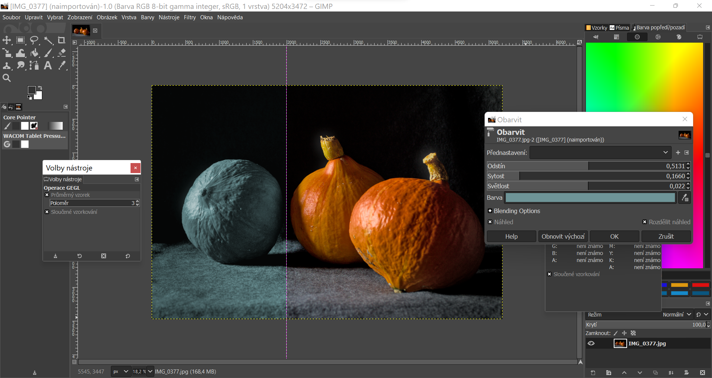

# Retuše

## GIMP a úprava fotografií
- vrstvy
- maskování
- prolínání vrstev
- křivky a úrovně
- retuše obsahu
- AI
## Portréty
- oči a výraz
- barevné tóny
- struktury a pleťové odstíny
## Krajiny
- obloha a kontrast
- světla a stíny
## Světlo a barva
- úprava světelné vyváženosti
- barevná teplota

## Ořez
- kompoziční ořez
- ořez obrysu
