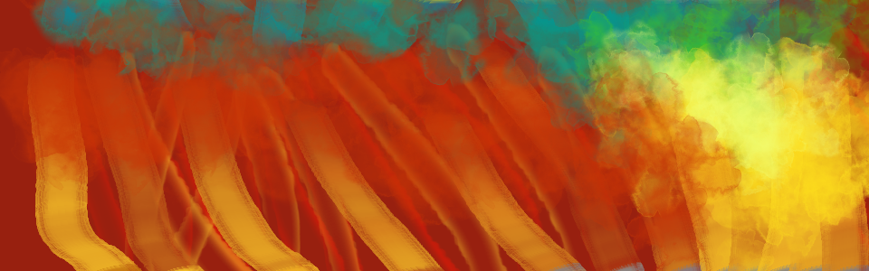

# Co v lekcích najdeš

- Základy animace
- Akcenty a stylizace
- 2D animace (Krita, Blender)
- 3D animace (Blender)
- Motion Design (Blender)
- Animace typografie (Blender)
- Animace efektů (Natron)

## Software v kurzu

Hlavní: Blender, Krita, Natron  
Utility: Gimp, G'MIC  
Zdroje:
