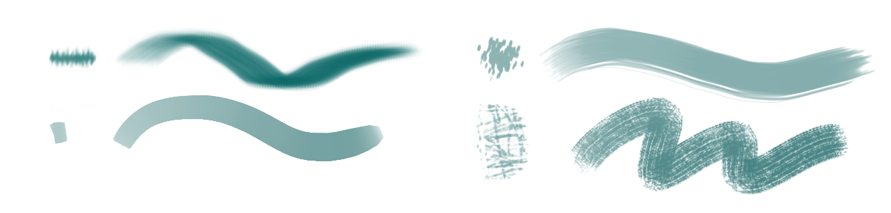

# Instalace

<!-- Options, autoload workbench. Part designer -->

text

# Systém práce v programu FreeCAD

FreeCAD je **modulární** software na principu pracovních prostředí (*Workbench*). Filozofie práce v programu je odlišná od jiných modelovacích programů.

Cílem kurzu je co nejjednodušší workflow pro design. Spolupráce s programy Blender a Inkscape.

Dokumentace a 3D tisk.

## Moduly pro kurzy
Kreslení konstruktivní (matematicky definované pomocí limitů, (*Constraints*).

Geometrie konstruktivní. Definice objektů parametry a limity.

- Sketcher

set orientation, pak kreslit
Constraints

- Part Design
Tento modul je vhodný pro navrhování součástek.

Metodologie.
Feature editing methodology. nacrt.

- TechDraw

ISO a ASME kótování technických výkresů.

Export a import 2D, 3D formátů.

Další funkce a moduly jako například analýza nebudeme v kurzu probírat. Jenom je stručně zmíníme.

## Nurbs
## Parametrické modelování
## Propojení s ostatními programy
Výhody a nevýhody.

Nejpoužívanější nástroje z doku Panel nástrojů (*Toolbox Docker*) jsou Štětec <kbd>B</kbd> , Pipeta <kbd>P</kbd> , nástroje výběru a transformace.

Doky (*Dockers*) jsou funkční okna, která můžeš přesouvat po pracovní ploše. Panel nástrojů prakticky nebudeš při malování používat příliš často, protože nejčastější nástroje budeš přepínat zkratkami (naštěstí je jich celkem málo). Každý nástroj má možnosti nastavení (*Tool Options*). V základním nastavení je najdeš vpravo nahoře mezi doky.

import Tabs from '@theme/Tabs';
import TabItem from '@theme/TabItem';

<Tabs
  groupId="jazykova-verze"
  defaultValue="czv"
  values={[
    {label: 'CZ verze', value: 'czv'},
    {label: 'EN verze', value: 'env'},
  ]
}>
<TabItem value="czv">Program máš v české verzi</TabItem>
<TabItem value="env">Program máš v anglické verzi</TabItem>
</Tabs>

## Part Designer
Skutečný štětec je jako razítko, které se pohybuje po médiu a přenáší na něj barvu. Tvar, materiál a rychlost štětce určuje deformace během tahu a charakter stopy. V softwaru se tento efekt simuluje přenášením modifikací tvaru profilu štětce (většinou textura s průhledností) a dynamikou a rychlostí tahů pera grafického tabletu. Program Krita nabízí řadu funkčních algoritmů štětců (*Brush Engines*), které jsou vhodné pro vytváření různých kreslících nástrojů. Každý kreslící nástroj (i tužka nebo pero) je z pohledu programu štětec (*Brush*).

### Předvolby štětců
:::note tip
Nastavení počtu zobrazených předvoleb štětců na vyskakovací paletě najdeš v hlavním menu:

 <Tabs
  groupId="jazykova-verze"
  defaultValue="czv"
  values={[
    {label: 'CZ verze', value: 'czv'},
    {label: 'EN verze', value: 'env'},
  ]
}>
<TabItem value="czv">Nastavení ‣ Nastavit aplikaci Krita ‣ Obecné ‣ Různé</TabItem>
<TabItem value="env">Settings ‣ Configure Krita ‣ General ‣ Miscellaneous</TabItem>
</Tabs>
:::

### Skupiny štětců
Štětce jsou rozdělené do určených skupin podle štítků (tagů). Základní skupiny si můžeš prohlédnout i ve vyskakovací kruhové paletě (*Pop-up Palette*), kterou zobrazíš pravým tlačítkem, pokud máš vybraný nějaký kreslící nástroj. Vlastní skupiny lze vytvářet. Štětce můžeš upravovat a importovat i exportovat jako sety. Více o vytváření vlastních štětců  a balíčcích zdrojů (*Resource Bundles*) v lekci Vlastní štětce a zdroje.

Vyzkoušej si úpravu štětce. Vyber štětec X a v předvolbě štětců nastav texturu vzoru. Potom nastav texturu povrchu. Vyzkoušej štětec. Základní nastavení vrátíš ,,,

:::note úkol

Vyzkoušej si různé skupiny štětců. Zapni a vypni texturu u štětce.

:::

## Pipeta na výběr barvy
Zkratka <kbd>P</kbd> . Umožnuje najenom nabírat barvu z plátna, ale i interpolovat barvy. Funkci aktivuješ nastavením procent Míšení (*Blend*) v doku Možnosti nástrojů (viz obrázek). Jedním kliknutím pak nabereš barvu, druhým kliknutím nabereš druhou. Pipeta pak vytvoří interpolaci barev. Vyzkoušej si to. Nastavením míšení zpět na 100% tuto funkci zase vypneš.
## Výběr
Funkce výběru ti dovoluje malovat pouze do označené části, po inverzi výběru pouze mimo ni. V panelu nástrojů jsou různé tvary výběru určené pro rychlé maskování. Tento nástroj funguje podobně jako v ostatních bitmapových programech. Jenom tady ho budeš používat častěji.
## Barevný selektor
Pipeta. <keyb>P</keyb> Umožnuje najenom nabírat barvu z plátna, ale i interpolovat barvy. Vyzkoušej si to.

## Přesuny a transformace

<kbd>T</kbd> Posun aktivní vrstvy, <kbd>Ctrl</kbd>+<kbd>T</kbd> Transformace.

# Základní techniky digitální malby
simulace, přiznana dig. m. a komb t
Tyto postupy jsou zajímavé buď organizací, nebo technikou malby.
### Alla prima
*Alla prima* ("napoprvé") je technika, kdy pracuješ v jedné vrstvě. Barvy nanášíš přímo a glazury také. Tento způsob je vhodný pro studium tonality a barev. Je to oblíbený způsob, a koncept *Alla prima* se používá v i klasické malbě, kdy se maluje do ještě vlhkých barev, na jedno sezení. Výsledek je dynamický obraz se zvláštní energií.

### Malování ve vrstvách
Vrstva světla - Overlay
Vrstva stínu - Multiply
Pozadí středová hodnota

### Systém pěti vrstev
Vrstva světla - Overlay
Vrstva stínu - Multiply
Vrstva barvy - Color
Vrstva tonality - Values
Vrstva náčrtu - Background

### Maskování
Připomíná techniku maskování části plátna, která se používá například v airbrushi.

### Malování v blocích
Nanášení tvarů.

### Kombinované techniky

Štětec jako razítko. Typy vyhlazování. Dynamika tahů.
## Barevné modely
Barvy pro tisk a obrazovku. Gamut.
## Barva a palety

## Vnímání tvaru
Zrcadlení plochy <kbd>M</kbd> pro rychlou kontrolu.
## Plynulá kresba a malba
Otáčení plátna

## Stínování
Šrafury a dynamika, airbrush. Vyzkoušej si Barevné stínování <kbd>K</kbd>, <kbd>L</kbd>. Více v lekci Malujeme barvu.
## Vrstvy
Přesun mezi vrstvami, hide etc.
## Kresba
Základní technika. Import kresby ze skicáře.

:::note úkol

Vystínovat těleso tonální technikou.

:::
