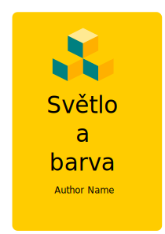

# O knihách

Tato sekce bude obsahovat odborné knihy projektu Digitální Akademie volně ke stažení.

- Proporce a perspektiva
- Barva
- Efektivní osvětlení v prezentaci
- Historie a vývoj
- Knihy

- Test odkazů ke stažení

## Světlo a barva

**Autor:** X Y | **Rok:** 2023 | **O knize:**

Pohled na vnímání světla a barev z pohledu umění, vědy a kulturní historie.

## Teorie umění

**Autor:** X Y | **Rok:** 2021 | **O knize:**

Teorie umění jako kognitivní potřeby a subjektivní vnímání kultury v historii vědy.

