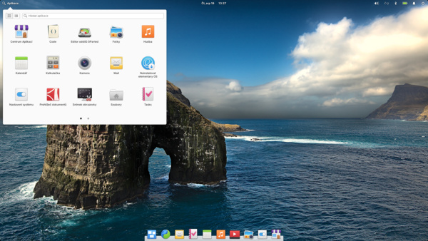

# Linux a kreativní software

Všechny programy v kurzech běží také na Linuxu (distribucí je mnoho set). Distribuce v článku jsou vybrané i s ohledem na snadnost instalace nejnovějších verzí grafických programů (proto tam není např. Linux Mint nepodporující Ubuntu Snap). Ideálně by měly distribuce běžet dobře na desktopu — i na laptopu a konvertibilních zařízeních (2v1), používaných často při grafické práci. Poznámky se týkají **základních** instalací (protože mnoho funkcí se dá v Linuxu upravit, doinstalovat nebo vyměnit).

Důležité hledisko je také snadná instalace správců balíčků (snap, flatpak) umožňující **jednoduchou instalaci aplikací z terminálu**. Přestože mnoho distribucí obsahuje různé verze prohlížečů, softwarových center a instalátorů aplikací, obecně se v nich špatně vyhledává podle filtrů a aplikace nejsou nejaktuálnější.

## Distribuce Linuxu

Doporučené distribuce Linuxu pro design s ohledem na:

- jednoduchost ovládání
- práci na desktopu
- univerzálnost
- výkon a náročnost na HW
- vertikální zobrazení
- konvertibilní zařízení, 2v1
- ovládání hybridní grafiky
- tablet a dotykový display
- funkčnost grafického tabletu
- práce s videem a 3D grafikou

### KDE Neon

- základ s desktopem Plasma
- možnosti nastavení

Funkční distribuce Ubuntu s pokročilým desktopem KDE Plasma. Desktop má nastavitelné komponenty a layout je snadné upravit podle potřeby. Díky podpoře Ubuntu Snap a Flatpak manažerů softwaru už v základní instalaci je přidávání aplikací snadné. Systém běží velice plynule.

### Zorin

- univerzální distribuce
- nejlepší podpora konvertibilních zařízení (s problémovou systémovou onscreen klávesnicí, což je ale zatím typické pro většinu distribucí)
- autorotace, vertikální zobrazení
- alternativy layoutu desktopu
- frakční škálování zatím pouze experimentální verze (200% bezproblémové)
- snap i flatpak v základní instalaci
- atraktivní desktopové prostředí

Zorin OS je vhodný pro začátečníky. Nastavení je jednoduché a voleb je právě tolik, kolik je třeba. Je to téměř ideální Ubuntu distribuce, i ve volně dostupné verzi Core (verze Pro má více nastavení desktopu, předinstalované aplikace a je placená). Volná verze Core není nijak funkčně omezená.

### Kubuntu

- univerzální a svižné
- základní instalace velice dobrá
- snadná instalace aplikací
- atraktivní desktop který se snadno upravuje

Kubuntu je velice rychlý systém s KDE Plasma desktopem, umožňující snadné přizpůsobení prostředí.

### Peppermint

- efektivní a rychlé
- jednoduché ovládání

Peppermint je rychlá a stabilní distribuce s Xcfe desktopem.

### Pop!_OS

- jednoduché a stylové
- atraktivní ovládání
- inspirované OS X
- autorotace

Jednoduše ovladatelná distribuce se zajímavým ("moderním retro") designem a vyváženým výkonem. Je cílená na začínající s Linuxem — nemá mnoho nastavení desktopu, nejsou potřeba.   

### elementary OS

- efektní a rychlé
- autorotace
- design inspirovaný OS X
- minimalizace oken nestandartní (dá se nastavit doinstalací Elementary Tweaks)
- zajímavá picture-in-picture funkce
- předinstalovaná virtuální onscreen klávesnice Onboard

Má unikátní rozhraní a ovládání, což je výhoda a může to být i nevýhoda, pokud je uživatel zvyklý na jiný systém (zkratky je nutné přenastavit). Doporučuji vyzkoušet. Je to velice funkční systém už v základní instalaci — cílem je jednoduchý a přehledný systém.

### Ubuntu Studio

- specializace na multimedia
- nastavení JACK audio v systému
- většina existujících programů pro design je nainstalovaná se systémem

Ambiciózní distribuce, obsahující předinstalované kreativní programy pro grafiku i multimedia. Naprosto ideální pro vyzkoušení většiny kvalitních open source programů pro mediální tvorbu a design.

### Fedora Design Suite

- předinstalované grafické programy Blender, Krita, GIMP, Inkscape, Scribus, Darktable, Shotwell
- dobré pro seznámení s Fedora distribucí Linuxu

Fedora Design Suite je upravená verze distribuce Fedora Workstation, připravovaná agenturou Fedora Design Team. Je pro pokročilejší uživatele (znalost nastavení kodeků a ovladačů v Linuxu nutnost).

Fedora využívá desktopové prostředí GNOME 3.40, se všemi výhodami i nevýhodami (matoucí především pro uživatele jiných operačních systémů).

Desktop je v podstatě obrázek pozadí pro funkci Aktivity. Na jednotlivé desktopy se rozmisťují otevřené aplikace, nejde na ně umístit ikony, odkazy nebo soubory (bez doinstalování různých rozšíření, nebo jiného desktopového prostředí). Pro další úpravy rozhraní je nutné nainstalovat např. aplikaci GNOME Tweaks (z aplikace Software). Je také vvýhodnější mít aspoň 16GB paměti.

Je to kvalitní a svižný systém pro specifické využití.

### Ostatní distribuce
Programy běží samozřejmě i na jiných distribucích. U některých je někdy potřeba nastavit např. grafiku kvůli možným problémům s ovladači grafické karty (screen tearing, scroll tearing) nebo jiné ovladače zařízení a kodeky na přehrávání médií manuálně. Některé v základním repositáři neobsahují aktuální verze programů, nebo mají komplikovanou instalaci správců balíčků a repozitářů pro nezkušeného (a někdy i zkušeného) uživatele. Distribuce Linuxu se často posuzují podle vzhledu, který ale tvoří **desktopové prostředí** (*Desktop Environment, DE*). Jádro a varianta samotné distribuce může být ale důležitější pro danou aplikaci a stabilitu.

Další kvalitní distribuce jsou například základní Ubuntu, MATE, Manjaro, Debian, deepin (znalost čínštiny výhodou), Mageia, Solus, Fedora atd.

## Srovnání s Windows 11

Windows jsou lépe využitelné na konvertibilních zařízeních a laptopech (především podpora hybridní grafiky je bezproblémová). Desktopové prostředí je plynulejší, systém ale vyžaduje mnohem více prostředků. Zobrazovací funkce jako frakční škálování (umožňující zobrazovat desktop např. ve zvětšení 1.25) jsou lépe vyřešené a funkční ve Windows. Také funkce  přístupnosti (Accesibility), onscreen klávesnice, ovládání hlasem (diktování) a pomocí gest na touchcreenu a touchpadu.

Obecně lze říci, že Windows jsou vhodné pro nejširší spektrum aplikací a zařízení, zpravidla s výkonnějším hardwarem. Linux distribuce jsou vynikající pro specifické aplikace (a určité programátorské zázemí uživatele je výhodou). Některé aplikace běží v určitých sestavách na Linuxu lépe (Kdenlive). Žádná distribuce Linuxu ale zatím (srpen 2021) nepodporuje **plně** konvertibilní zařízení, především kvůli funkčnosti **onscreen klávesnice** a ovladačům autorotace displeje.

## Seznam vybraných distribucí

| Distribuce        | Package Manager    | Odkaz                                           |
|-------------------|--------------------|-------------------------------------------------|
|                   |                    |                                                 |
| **Zorin**         | snap, flatpak, apt | https://zorinos.com/download/                   |
| **Kubuntu**       | snap, flatpak\*    | https://kubuntu.org/getkubuntu/                 |
| **Peppermint**    | snap               | https://peppermintos.com/guide/downloading/     |
| **Ubuntu Studio** | snap, apt          | https://ubuntustudio.org/download/              |
| **elementary OS** | snap\*, flatpak    | https://elementary.io/                          |
| **Pop!_OS**       | snap\*, flatpak    | https://pop.system76.com/                       |
| **KDE Neon**      | snap, flatpak      | https://neon.kde.org/download                   |
| **deepin**        | snap\*, dpkg, apt  | https://www.deepin.org/en/download/             |
| **Mageia**        | snap\*, urpmi, rpm | https://www.mageia.org/en/downloads/            |
| **Fedora DS**     | snap\*, flatpak\*  | https://labs.fedoraproject.org/en/design-suite/ |
|                   | \*lze doinstalovat |                                                 |
|                   |                    |                                                 |

Uvedený Package Manager je pro řízení instalace aplikací, ne systémových balíčků. Označené položky je možné na systému doinstalovat.

## Struktura Linuxových systémů

- Linuxové jádro (kernel)
- Základní verze, distribuce, distro (např. Ubuntu, Debian, Arch Linux). Distribuce jsou i odvozené verze, deriváty, např. Manjaro je derivát Arch Linuxu, Red Hat Enterprise Linux (RHEL) je derivát Fedora, CentOS je derivát RHEL, AlmaLinux je derivát CentOS.
- Desktop Environment (např. KDE Plasma, GNOME,  Xfce, LXDE)
- Window Manager (např. Fluxbox, IceWM) pro X Window System (X11) grafického uživatelského rozhraní (např. KDE)
- Compositor, zobrazovací framework např. Wayland Compositor s protokolem Wayland, X Windows System s protokolem X11
- Display Manager, např. GDM (používaný GNOME), SDDM (používaný KDE)
- Package Manager, systém pro správu systémových balíčků a/nebo instalaci aplikací (např. Apt, Flatpak, Ubuntu Snap). Mohou mít grafické uživatelské rozhraní (GUI), např Synaptic je GUI pro Apt.
