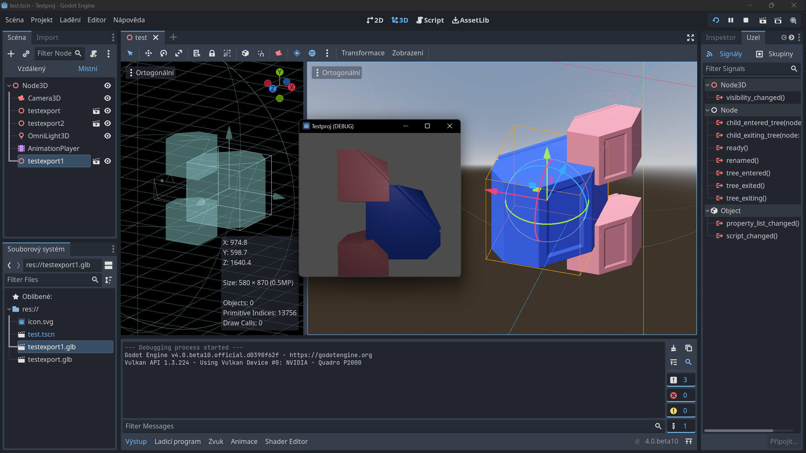

# Godot: Menu systém pro aplikace a hry




## Tlačítka a signály

Vytvoříme jednoduché funkční tlačítko.
1. Ve scéně vytvoř uzel Button
2. Zadej text (Quit)
3. V docku **Node** vyber **BaseButton ‣ pressed()**
4. Připoj signál ke skriptu scény
5. Napiš fukční skript:

```gdscript
func _on_button_pressed():
	get_tree().quit()
```

:::info Signály

Signály jsou procesy které propojují jednotlivé uzly nebo přímo určují funkčnost.
:::

## Uživatelské rozhraní (UI) a rámce

Jednoduché menu doporučuji vytvářet v rámcích  kontrolních uzlů a pro doladění grafiky používat témata.


## Grafika menu, styly a témata

Témata (Themes) umožňují vytvářet styly, které je možné využívat v celém projektu.

import Tabs from '@theme/Tabs';
import TabItem from '@theme/TabItem';

<Tabs
  groupId="jazykova-verze"
  defaultValue="czv"
  values={[
    {label: 'V české verzi', value: 'czv'},
    {label: 'V anglické verzi', value: 'env'},
  ]
}>
<TabItem value="czv">Editor ‣ Nastavení editoru ‣ FileSystem ‣ Import ‣ Blender ‣ Blender Path</TabItem>
<TabItem value="env">Editor ‣ Editor Settings ‣ FileSystem ‣ Import ‣ Blender ‣ Blender Path</TabItem>
</Tabs>


