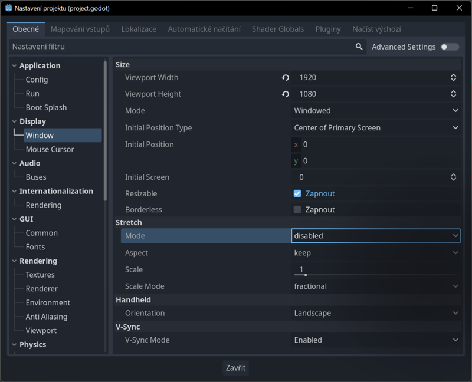

# Godot: Změna aspektu a rozlišení

## Nastavení projektu

Pro změnu aspektu je nutné zvážit design aplikace a použití kontrolních uzlů. V mobilních aplikacích se často využívá možnost měnit orientaci (Portrait/Landscape). Obecně je vhodná pevná orientace pro hry a senzorem nebo nastavením ovládaná oriantace okna aplikace pro utility a jiné programy. Nastavení projektu pro změnu orientace senzorem a nastavení okna:

V nastavení zkontroluj Obecné ‣ Display ‣Window ‣ Stretch ‣ Mode , nastav na disabled.

:::info

Pro interaktivní aplikace se doporučuje zvolit optimální orientace zobrazení
:::

## Kontrolní uzly 

## Nastavení pro Blender

import Tabs from '@theme/Tabs';
import TabItem from '@theme/TabItem';

<Tabs
  groupId="jazykova-verze"
  defaultValue="czv"
  values={[
    {label: 'V české verzi', value: 'czv'},
    {label: 'V anglické verzi', value: 'env'},
  ]
}>
<TabItem value="czv">Editor ‣ Nastavení editoru ‣ FileSystem ‣ Import ‣ Blender ‣ Blender Path</TabItem>
<TabItem value="env">Editor ‣ Editor Settings ‣ FileSystem ‣ Import ‣ Blender ‣ Blender Path</TabItem>
</Tabs>

