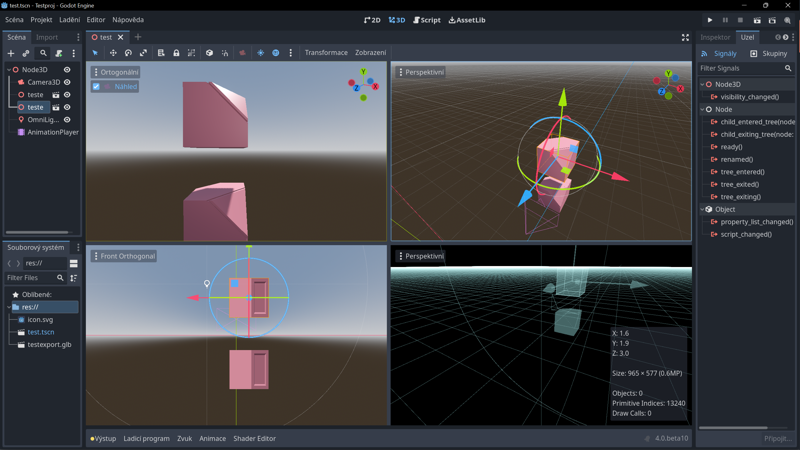

# Programování her a  interaktivních prezentací

V předcházejících lekcích jsme se zabývali tvorbou grafiky, modelů  a animací. Tato sekce spojuje různé druhy multimediálního obsahu do vytvoření vlastního interaktivního projektu. 

Jako ukázkový budu používat volně dostupný engine **Godot** (principy práce s obsahem jsou podobné i u nejrozšířenějších enginů Unity a Unreal).

## Přehled témat

### Import a export assetů z programů Blender, Gimp, Inkscape a Krita
### Menu systém
### Proměnné a databáze
### Nahrávání a ukládání dat
### Grafický systém

### Projekt 1: Prohlížeč 3D objektů
### Projekt 2: Interaktivní 3D vizualizace architektury
### Projekt 3: 2D hra
### Projekt 4: 3D hra

## Tutoriály pro specifické úkoly a technické tipy

Lekce věnované specifickým nebo novým funkcím programů.

## Zvuk: úvod

- Audacity, Ardour

