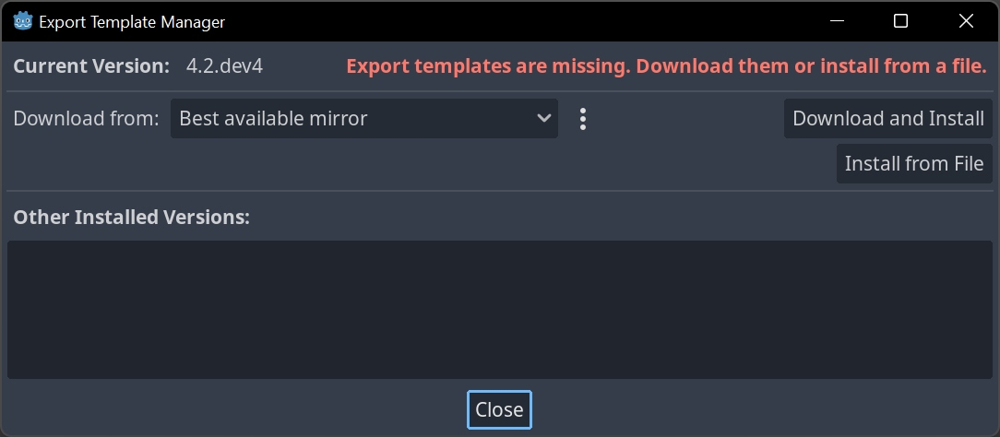
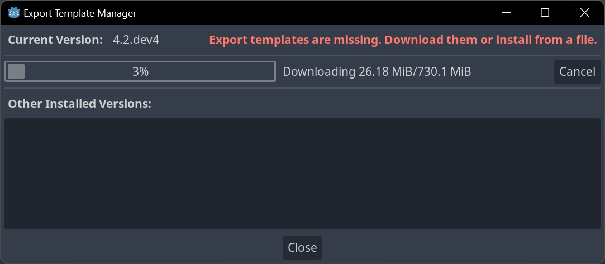
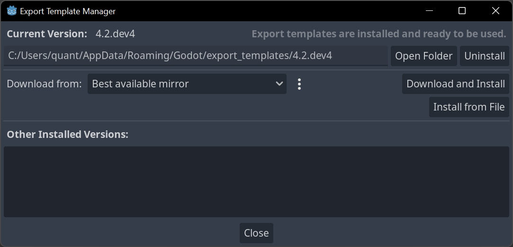
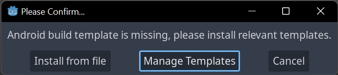
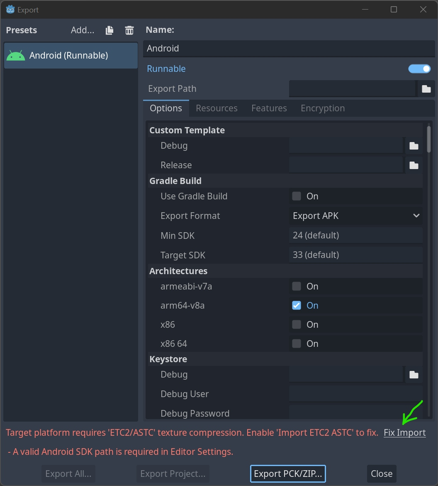
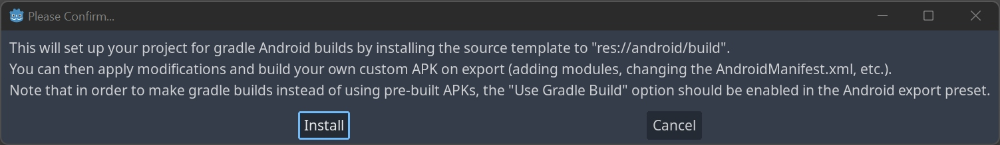

# Godot: Instalace

## Stažení a instalace
Instalace je jednoduchá. Najdi aktuální verzi na https://godotengine.org/ . .NET verze obsahuje podporu pro C#.

:::note Vývojové verze
Starší verze a nejnovější alfa verze (Developers Snapshots) najdeš také v repozitáři na https://downloads.tuxfamily.org/godotengine/. 
Tyto verze jsou pro vyzkoušení novinek a stability.

:::

Stáhni a rozbal instalační soubor pro tvojí verzi systému.
Program se ve Windows neinstaluje a lze ho rovnou spustit z adresáře.

:::info GODOT NAINSTALOVÁN
Nyní můžeš program spustit a začít tvořit.

:::

## Nastavení jazykové verze
Jazykovou verzi programu změníš v menu (překlady nejsou zpravidla zcela kompletní):

import Tabs from '@theme/Tabs';
import TabItem from '@theme/TabItem';

<Tabs
  groupId="jazykova-verze"
  defaultValue="czv"
  values={[
    {label: 'V české verzi', value: 'czv'},
    {label: 'V anglické verzi', value: 'env'},
  ]
}>
<TabItem value="czv">Editor ‣ Nastavení editoru ‣ Všeobecné ‣ Rozhraní ‣ Editor ‣ Jazyk editoru</TabItem>
<TabItem value="env">Editor ‣ Editor Settings ‣ General ‣ Interface ‣ Editor ‣ Editor Language</TabItem>
</Tabs>

## Seznámení s programem

V tuto chvíli můžeš pokračovat s dalšími lekcemi pro začátečníky, Godot jsi úspěšně nainstaloval. Zbytek článku je pro pokročilé uživatele, a k tématu exportu a kompilace programů se ještě vrátíme. 

## Nastavení pro Blender

<Tabs
  groupId="jazykova-verze"
  defaultValue="czv"
  values={[
    {label: 'V české verzi', value: 'czv'},
    {label: 'V anglické verzi', value: 'env'},
  ]
}>
<TabItem value="czv">Editor ‣ Nastavení editoru ‣ FileSystem ‣ Import ‣ Blender ‣ Blender Path</TabItem>
<TabItem value="env">Editor ‣ Editor Settings ‣ FileSystem ‣ Import ‣ Blender ‣ Blender Path</TabItem>
</Tabs>

## Version Control: Nastavení kontroly verzí

## Nastavení pro export do OS platforem

Export vyžaduje stažení templatů pro jednotlivé platformy.

### Project ‣ Export

Pokud nejsou nainstalovány templaty pro export, zvolte možnost  Download and Install

### Project ‣ Install Android Build Template

Android template vyžaduje ETC2 ASTC kompresi textur. Klikni na odkaz  Fix Import v okně.

#### Valid Android SDK path is required in editor settings

Spusť znovu Project ‣ Install Android Build Template

V **Editor ‣ Editor Settings ‣ Export ‣ Android** nastav cestu k Android SDK

Aktuální dokumentace Godot k tématu  je [zde](https://docs.godotengine.org/en/stable/tutorials/export/exporting_for_android.html)

OpenJDK a Android SDK.

Další nastavení pro export si ukážeme v příslušné kapitole.

