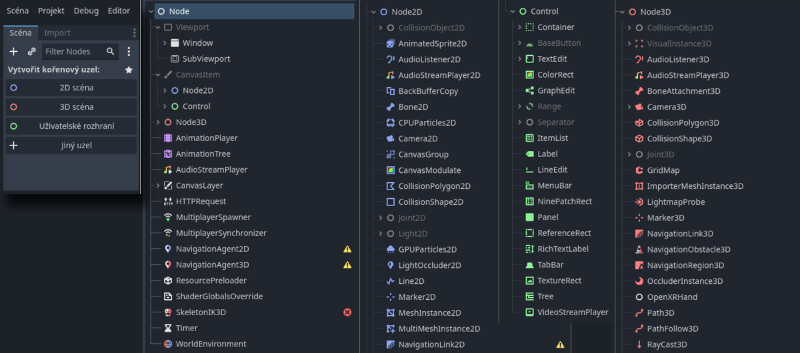
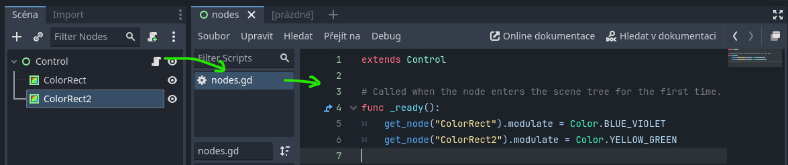
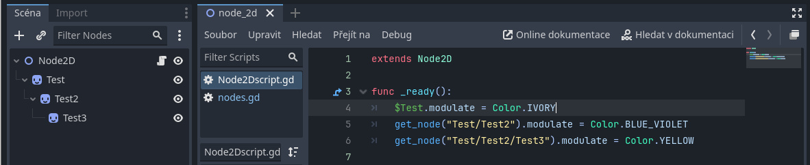

# Godot: Seznámení s uzly (základní ovládání, zkratky)

V této lekci se seznámíme s koncepty uzlů, scén, struktury aplikace (SceneTree) a signálů.

### 2D, 3D, kontrolní a speciální uzly




Scéna se skládá z uzlů různých typů. Každou aplikaci je možné vidět jako hierarchii vzájemně propojených uzlů, ke kterým jsou přiřazené skripty v jazyce GDSCRIPT. Uzly ve scéně si můžeme představit jako vnořené adresáře. Jednotlivé větve (Tree) spouští hlavní scéna, kterou je nutné označit v **Projekt ‣ Nastavení projektu ‣ Application ‣ Run ‣ Main Scene**.


:::info Odkaz na uzel ve scéně

Na uzly lze odkazovat jejich pozicí v hierarchii scény (cesta je relativní ke skriptu), zjednodušeně jejich názvem (pomocí **$NázevUzlu**, znak "$" automaticky doplní cestu), nebo funkcí get_node.



Dvě možnosti se stejnou funkcí:
```gdscript title="GDSCRIPT"
get_node("ColorRect").modulate = Color.BLUE_VIOLET
	$ColorRect2.modulate = Color.YELLOW_GREEN
```

Tento skript odkazuje na uzly ve scéně, která je jednoduchá. Doporučuje se odkazovat směrem Parent-Child (**get_node("ParentName/ChildName")**), opačným směrem ale lze použít **get_parent** , get_node("..") s adresářovou cestou ("../" pro relativní cestu vzhůru v hierarchii adresáře). 

Pro odkaz na stejný uzel použijeme get_node(".") nebo klíčové slovo **self**.

```gdscript
self.modulate = Color.BLUE_VIOLET
# nebo pouze modulate = Color.BLUE_VIOLET
```



Vnořené uzly musí mít uvedenou cestu (cesta se automaticky doplní přetažením ze scény). V tomto příkladu efekt modulate ovlivňuje uzly v hierarchii od shora dolů.
:::

:::tip Snadné adresy ve scéně (%)
Popsané metody mají tu nevýhodu, že při každé změně hierarchie je nutné měnit cesty v kódu. Pokud uzel nastavíme v kontextovém menu uzlu jako **%Access as Unique Name** (to je NUTNÝ krok a bez tohoto nastavení uzlu kompilace nefunguje), je možné ho volat odkudkoliv ze scény bez ohledu na hierarchii uzlů:

```gdscript title="GDSCRIPT"
get_node("%ColorRect").modulate = Color.BLUE_VIOLET
	%ColorRect2.modulate = Color.YELLOW_GREEN
```

:::


## Programování se scénami a uzly
Scény se snaž organizovat tak, aby šly spouštět a testovat samostatně.
### Parent/Child a inheritance 

### Signály
Signály propojují uzly a určují jejich funkci.


:::info Odkaz na root větev

```gdscript
func _on_button_pressed():
	get_tree().quit()
```
Tento butón ukončuje program (hlavní větev get_tree). 
:::

# Objekty ve scéně Godot editoru

:::info KONCEPT EDITORU
Ovládání editoru je velice podobné editorům Unity a Unreal.
:::

Anchor, pivot

## Skupiny

Skupiny slouží k tagování uzlů a vytváření skupin, které je možné volat skriptem. Skupiny je možné vytvářet kódem nebo v UI.


```gdscript title="GDSCRIPT"
func DestroyGroup1():
	get_tree().call_group("Group1", "queue_free")
```


## Zdroje


## Ovládání a spouštění scén
Scény a jejich komponenty je možné kombinovat.

## Kamera a efekty prostředí

Efekty kamery umožňují postprodukční efekty.

### Světla 2D a 3D

## Kolizní masky

- Collision Mask


## GDScript

GDScript je integrovaný skriptovací programovací jazyk, vhodný pro vytváření prototypů (Godot umožňuje programovat i v jiných jazycích). Tyto lekce budou v příkladech používat GDScript.

### Proměnné
### Funkce

## Nejpoužívanější zkratky

- Přidat uzel <kbd>Ctrl</kbd>+<kbd>A</kbd>, přidá uzel jako *Child* vybraného uzlu ve scéně
- Duplikovat <kbd>Ctrl</kbd>+<kbd>D</kbd>
- Skript editor: Označit vybrané jako komentář <kbd>Ctrl</kbd>+<kbd>K</kbd>
- Skript editor: Najít/Nahradit <kbd>Ctrl</kbd>+<kbd>F</kbd> , <kbd>Ctrl</kbd>+<kbd>R</kbd>
- Undo/Redo <kbd>Ctrl</kbd>+<kbd>Z</kbd> , <kbd>Ctrl</kbd>+<kbd>Shift</kbd>+<kbd>Z</kbd>
- Spustit program/projekt <kbd>F5</kbd>, Spustit aktuální vybranou scénu <kbd>F6</kbd>, Vyber a spusť scénu <kbd>Ctrl</kbd>+<kbd>Shift</kbd>+<kbd>F5</kbd>

- Focus <kbd>F</kbd> na vybraný objekt ve scéně
- <kbd>Ctrl</kbd>+<kbd>G</kbd> Group, vytvoří skupinu

## Příklad: Menu a butóny, práce s tématy


