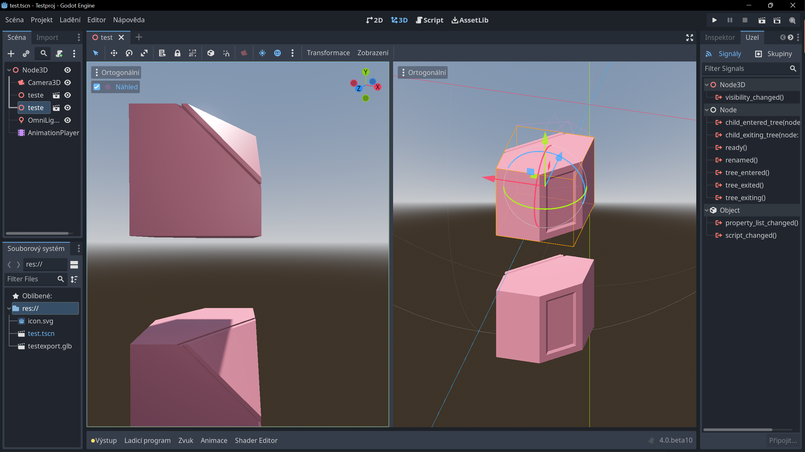

# Godot: Seznámení s uzly (základní ovládání, zkratky)

## Programování se scénami a uzly

:::info KONCEPT EDITORU
Ovládání editoru je velice podobné editorům Unity a Unreal.
:::

Stáhni a rozbal instalační soubor pro tvojí verzi systému.
Program se neinstaluje a lze ho rovnou spustit z adresáře.

# Objekty ve scéně Godot editoru

Anchor, pivot

## Zdroje

## Ovládání a spouštění scén
Scény a jejich komponenty je možné kombinovat.

## 2D, 3D a kontrolní uzly
Jazykovou verzi programu změníš v menu:

## Kamera a efekty prostředí

Efekty kamery umožňují postprodukční efekty.

## GDScript

GDScript je integrovaný skriptovací programovací jazyk, vhodný pro vytváření prototypů (Godot umožňuje programovat i v jiných jazycích). Tyto lekce budou v příkladech používat GDScript.

### Proměnné
### Funkce

## Nejpoužívanější zkratky

- Přidat uzel <kbd>Ctrl</kbd>+<kbd>A</kbd>, přidá uzel jako *Child* vybraného uzlu ve scéně
- Duplikovat <kbd>Ctrl</kbd>+<kbd>D</kbd>
- Skript editor: Označit vybrané jako komentář <kbd>Ctrl</kbd>+<kbd>K</kbd>
- Skript editor: Najít/Nahradit <kbd>Ctrl</kbd>+<kbd>F</kbd> , <kbd>Ctrl</kbd>+<kbd>R</kbd>
- Undo/Redo <kbd>Ctrl</kbd>+<kbd>Z</kbd> , <kbd>Ctrl</kbd>+<kbd>Shift</kbd>+<kbd>Z</kbd>
- Spustit program/projekt <kbd>F5</kbd>, Spustit aktuální vybranou scénu <kbd>F6</kbd>, Vyber a spusť scénu <kbd>Ctrl</kbd>+<kbd>Shift</kbd>+<kbd>F5</kbd>

- Focus <kbd>F</kbd> na vybraný objekt ve scéně
- <kbd>Ctrl</kbd>+<kbd>G</kbd> Group, vytvoří skupinu

## Příklad: Menu a butóny, práce s tématy

