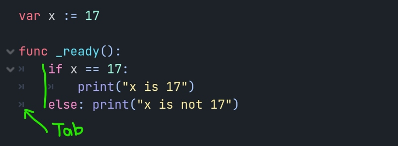
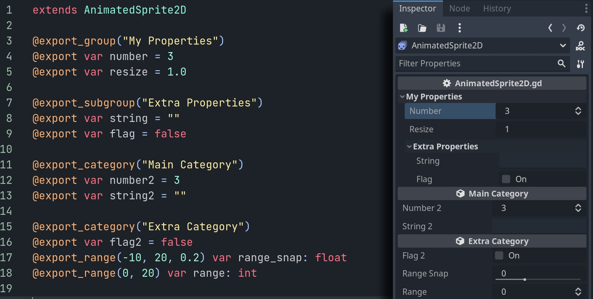

# Godot: GDSCript

GDScript je dynamický skriptovací jazyk určený pro program Godot. Výhodou je jednoduchost a integrace do vývojového prostředí Godot. Tato lekce je přehled výběru z funkcí GDScriptu, pro dokumentaci prostuduj odkazy v referencích. S funkcemi GDScriptu se budeme seznamovat i v dalších kapitolách.  

:::info Zvláštnosti GDScriptu
Odsazení dělej vždy pomocí tabulátoru <kbd>Tab</kbd>. Odsazení jsou součástí kódu a určují funkčnost.



Proměnné jsou také určené způsobem zápisu: 

```gdscript
var x = 1 # integer!
var y = 1.0 # float!
var z = "1.0" # string!
```
To je důležité u matematických operací, protože 3/2=1 (integer operace), **3.0/2=1.5 (float operace)**. Pro očekávaný výsledek je tedy třeba alespoň jednu proměnnou v operaci definovat jako float.
:::

Tato lekce bude pouze stručný přehled možností GDScriptu. Pro úplnou aktuální dokumentaci sleduj GDScript reference na konci článku.
```gdscript
# A file is a class!

# Inheritance

extends BaseClass

# (optional) class definition with a custom icon

class_name MyClass, "res://path/to/optional/icon.svg"


# Member variables

var a = 5
var s = "Hello"
var arr = [1, 2, 3]
var dict = {"key": "value", 2: 3}
var typed_var: int
var inferred_type := "String"

# Constants

const ANSWER = 42
const THE_NAME = "Charly"

# Enums

enum {UNIT_NEUTRAL, UNIT_ENEMY, UNIT_ALLY}
enum Named {THING_1, THING_2, ANOTHER_THING = -1}

# Built-in vector types

var v2 = Vector2(1, 2)
var v3 = Vector3(1, 2, 3)


# Function

func some_function(param1, param2):
    var local_var = 5

    if param1 < local_var:
        print(param1)
    elif param2 > 5:
        print(param2)
    else:
        print("Fail!")

    for i in range(20):
        print(i)

    while param2 != 0:
        param2 -= 1

    var local_var2 = param1 + 3
    return local_var2


# Functions override functions with the same name on the base/parent class.
# If you still want to call them, use '.' (like 'super' in other languages).

func something(p1, p2):
    .something(p1, p2)


# Inner class

class Something:
    var a = 10


# Constructor

func _init():
    print("Constructed!")
    var lv = Something.new()
    print(lv.a)

```

## Konstanty  a proměnné

Typy proměnných jsou definované způsobem zapsání (1 je integer, 1.0 float). To je třeba zohlednit v matematických operacích: 3/2=2 (operace integer), 3/2.0=1.5.

```gdscript {0} title="GDSCRIPT" showLineNumbers
const NUMBER = 5
var number = 3
```

## Operátory

## Rezervovaná slova

- konstanty, proměnné, funkce

## Funkce a metody

:::info KONCEPT EDITORU
Ovládání editoru je velice podobné editorům Unity a Unreal.
:::

Stáhni a rozbal instalační soubor pro tvojí verzi systému.
Program se neinstaluje a lze ho rovnou spustit z adresáře.

## Proměnné ve scéně: Lokální proměnné a export proměnných

Anchor
```gdscript
extends AnimatedSprite2D

@export_group("My Properties")
@export var number = 3
@export var resize = 1.0

@export_subgroup("Extra Properties")
@export var string = ""
@export var flag = false

@export_category("Main Category")
@export var number2 = 3
@export var string2 = ""

@export_category("Extra Category")
@export var flag2 = false
@export_range(-10, 20, 0.2) var range_snap: float
@export_range(0, 20) var range: int
```


var x := 17

func _ready():
	print("x")


## Anotace
Anotace je druh tokenů, začínajících znakem @. Příklad exportu proměnných do editoru:

```gdscript {0} title="GDSCRIPT" showLineNumbers
@export_group("My Properties")
@export var number = 3
```




## Data Container

## Zdroje (Resources)

## GDScript reference

- [GDScript základy v češtině](https://docs.godotengine.org/cs/stable/tutorials/scripting/gdscript/gdscript_basics.html)
- [GDScript základy v angličtině](https://docs.godotengine.org/en/stable/tutorials/scripting/gdscript/gdscript_basics.html)
- [gdscript.com](https://gdscript.com/tutorials/)
- [GDScript Guide](https://gamedevacademy.org/complete-gdscript-godot-tutorial/)


