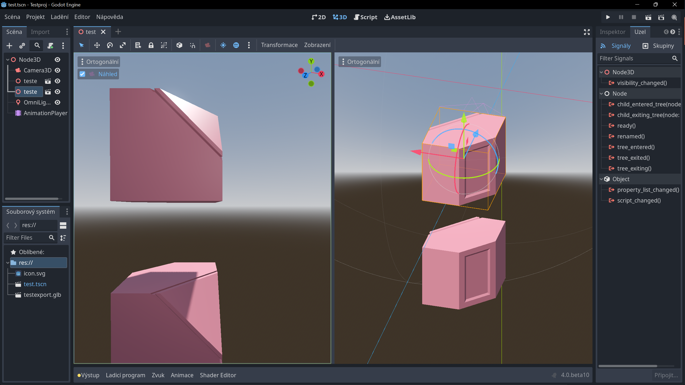

# Godot: GDSCript

## Funkce a proměnné

:::info KONCEPT EDITORU
Ovládání editoru je velice podobné editorům Unity a Unreal.
:::

Stáhni a rozbal instalační soubor pro tvojí verzi systému.
Program se neinstaluje a lze ho rovnou spustit z adresáře.

# Proměnné ve scéně: Lokální proměnné a export proměnných

Anchor

