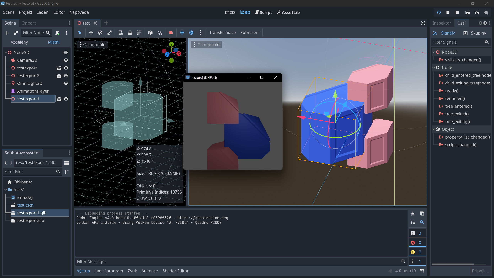

# Godot: Animace a křívky

## Animace objektů a vlastností

## Animace spritů 

## Animation tree 

## Formáty

:::info

Godot importuje **gLTF** a .blend. FBX formát vyžaduje použití konvertoru https://github.com/godotengine/FBX2glTF.

:::

## Textury 

## Godot a Blender: Import animací

import Tabs from '@theme/Tabs';
import TabItem from '@theme/TabItem';

<Tabs
  groupId="jazykova-verze"
  defaultValue="czv"
  values={[
    {label: 'V české verzi', value: 'czv'},
    {label: 'V anglické verzi', value: 'env'},
  ]
}>
<TabItem value="czv">Editor ‣ Nastavení editoru ‣ FileSystem ‣ Import ‣ Blender ‣ Blender Path</TabItem>
<TabItem value="env">Editor ‣ Editor Settings ‣ FileSystem ‣ Import ‣ Blender ‣ Blender Path</TabItem>
</Tabs>

