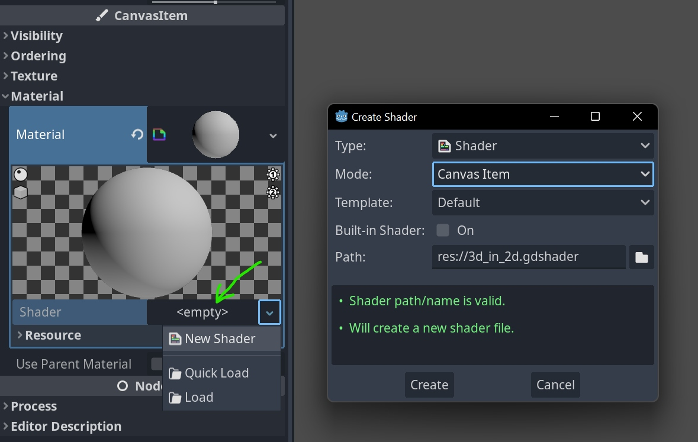

# Godot: Shadery

## Vytváření vlastních shaderů

### Skriptování shaderu pro objekt

1. vyber objekt (sprite) ve scéně nebo hierarchii (*Scene*)
2. Inspector > Canvas Item > Material, New Shader Material
3. Skript edituješ v otevřeném tabu



```jsx {0} title="GODOT SHADER SCRIPT" showLineNumbers
shader_type canvas_item;

//use visual shader for godot, hint_color changed in G4 to source_color
uniform vec4 flashing_color: source_color = vec4(1.0);
uniform float color_change: hint_range(0.0, 1.0) = 1;

void vertex() {
	// Called for every vertex the material is visible on.
}

void fragment() {
	vec4 color = texture(TEXTURE, UV);
	color.rgb = mix(color.rgb, flashing_color.rgb, color_change); 
	COLOR = color;
}

void light() {
	// Called for every pixel for every light affecting the CanvasItem.
}
```
Tento skript přiřazený objektu mění zabarvení spritu. Proměnné *uniform* umožňují ovládání v docku **CanvasItem/Material/Shader Parameters** v editoru.

Klíčová slova proměnných (TEXTURE, UV, atd.) a funkce (light, fragment, vertex, atd.) jsou předdefinována.

### Emission Glow Shader

### Drop Shadow Shader

## VisualShaders

VisualShader je typ shaderu umožňující programování pomocí logických uzlů. Tento typ nastavíš při vytváření shaderu.

- [VisualShader plugin](https://github.com/arkology/ShaderV), přednastavené shadery
- [VisualShaders Godot](https://docs.godotengine.org/en/stable/tutorials/shaders/visual_shaders.html)


## Shader assety a import

:::info

Shadery pro starší verze vyžadují opravy syntaxe. Shadery pro studium najdeš např. na [Godot Shaders](https://godotshaders.com/shader/) a 
Asset Library např. [zde (dema)](https://godotengine.org/asset-library/asset?filter=Shaders+Demo&category=&godot_version=&cost=&sort=updated) a [zde](https://godotengine.org/asset-library/asset?filter=&category=3&godot_version=&cost=&sort=updated)
:::

Některé shadery ke stažení vyžadují instalaci jako addon. 


