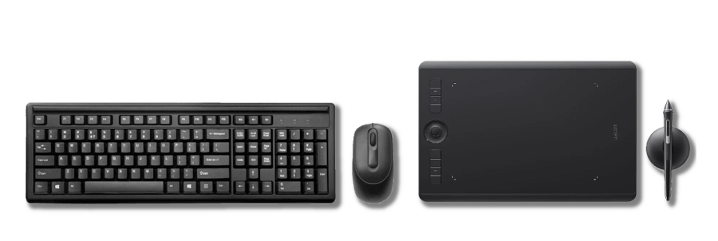

# Úvodem: Kreativita, vzdělávání a open-source

## Metodika kurzů

V psaných lekcích na těchto stránkách jsou stručné přepisy obsahu série videí na YouTube kanálu Digitální Akademie. Software je vybraný tak, aby tvořil komplexní workflow pro všechny typy tvorby v kurzech a jednotlivých lekcích, a zároveň byl pro každého volně dostupný.

Lekce má tyto části:

1. Přehled
2. Obsah a praktické předvedení
3. Shrnutí
4. Úkol/Cvičení

Lekce jsou minimalistické a snaží se předejít jistému fenoménu tutoriálů, takže:

## Komu je program určený?

Kurzy jsou zaměřené na osvojení základních kreativních principů, platných nezávisle na médiu. Koncept je založený na praktických cvičeních v daném softwaru a je určený jak pro začátečníky, tak pro pokročilé studenty, kteří chtějí objevovat nové postupy.

:::tip

Nikdo se nikdy nestal expertem **sledováním videí na internetu**. Nové znalosti musíš použít, a učení je zákeřně kontinuální proces.

:::

## Je program kurzů náročný na vybavení?

Kurzy předpokládají alespoň průměrné počítačové vybavení pro grafické aplikace. Některý software využívá dvoutlačítkovou myš se skrolovacím kolečkem, a numerická klávesnice je výhodou. Kurzy kreslení a malby vyžadují grafický tablet s přítlakem (i když teoreticky se dá malovat i myší...).

:::note Poznámka

 Počítačová technika je jenom nástroj. Když dokážeš efektivně používat to, co máš, tak nebudeš potřebovat to, co nemáš.

:::

## Proč open-source?

Aby byly kurzy co nejdostupnější, všechny lekce využívají profesionální software s licencí, který je open-source a volně ke stažení. Všechny programy také existují i ve verzích pro ty nejrozšířenější operační systémy.

:::tip

Nenech se při učení **ničím** rozptylovat. Každá lekce se vejde do patnácti minut.

:::
## Začni ještě dnes!
Lekce jsou navržené tak, aby byly co nejkratší a nejefektivnější. Cílem je co nejrychlejší využití nových technik.

Výběr témat:

[Digitální kresba a malba](01digitalnimalba/kresba-a-malba) (Krita)
[Modelování a sochařství](02modelovani/3D-modelovani) (Blender)
[Grafika a typografie](03grafika/grafika) (Inkscape, Scribus)
[Fotografie a retuše](04foto/foto) (Gimp, Darktable)
[Filmový střih](05film/film) (Kdenlive, Blender)
[Animace a vizuální efekty](06animace/animace) (Blender, Natron)
[CAD a 3D design](07cad/cad) (FreeCAD)

:::tip

Nenech se při učení **ničím** rozptylovat. Každá lekce se vejde do patnácti minut.

:::
