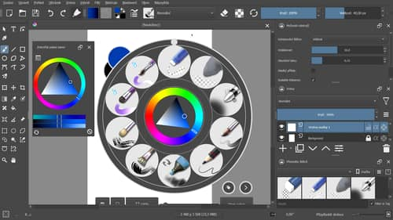
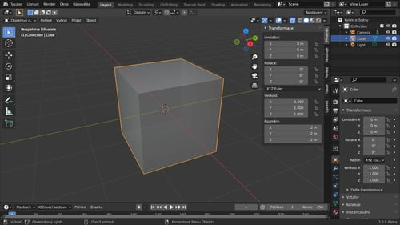
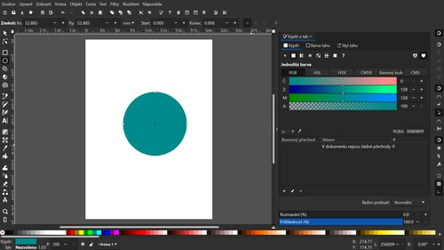
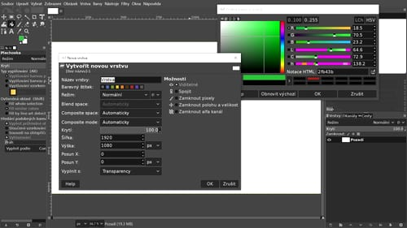
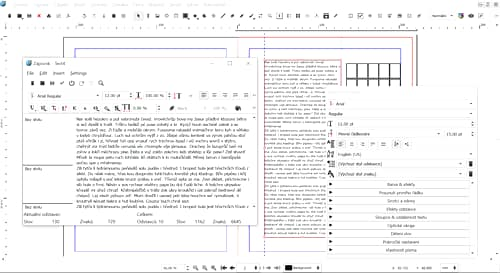
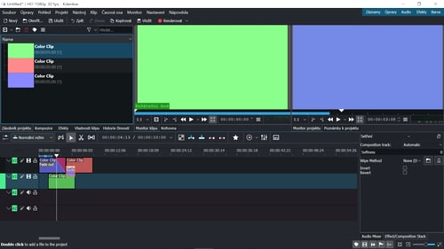

# Software a utility

### Seznam programů použitých v kurzech

## Krita

Krita je specializovaný kreslící program s rozsáhlou paletou algoritmů štětců a editačními možnostmi. Je to bitmapový program který umí pracovat s vektorovými vrstvami.
Program využiješ v kurzu [Digitální kresba a malba](01digitalnimalba/kresba-a-malba).

## Blender

Blender je rychle se vyvíjející program specializovaný na 3D modelování, animace a vizualizace. Je univerzální, dá se v něm stříhat video, vytvářet efekty, generovat textury i kreslit a malovat.
Program využiješ v kurzech [Modelování a sochařství](02modelovani/3D-modelovani), [Animace a vizuální efekty](06animace/animace) a [CAD a 3D design](07cad/cad).

## Inkscape

Inkscape je program pro vektorovou grafiku, typografii a grafický design. Umí pracovat i s bitmapami a vytvářet bitmapové efekty a aplikovat filtry.
Program využiješ v kurzu [Grafika a typografie](03grafika/grafika), a protože nativně pracuje s vektorovým formátem **.svg**, tak i v ostatních kurzech.

## Gimp

Gimp je určený pro editaci bitmapových obrázků a retuše fotografií. Dá se v něm malovat ve vrstvách, jako v programu Krita. Program využiješ ve všech kurzech, především v kurzu [Fotografie a retuše](04foto/foto).

## Scribus

Scribus je program pro počítačovou sazbu. Je určený na přípravu tiskovin, od jednostránkových letáků po knihy a časopisy. Pracovat se s ním naučíš v kurzu [Grafika a typografie](03grafika/grafika).

## Kdenlive

Kdenlive je program na úpravu videa. Naučíš se v něm základy střihu a postprodukce v kurzu [Filmový střih](05film/film).

## Natron

Natron slouží na přípravu animací a vizuálních efektů. Využívá vizuální programování pomocí  funkčních uzlů (*nodes*), podobně jako Blender. Má profesionální funkce a seznámíš se s ním v kurzu [Animace a vizuální efekty](06animace/animace).

## FreeCAD

FreeCAD je parametrický modelovací program pro průmyslový design. Dokáže vytvářet modely pro CAD/CAM a technické výkresy pro široké spektrum aplikací. Seznámíš se s ním v kurzu [CAD a 3D design](07cad/cad).

---

### Další programy

## XnView MP

Program na prohlížení, třídění a základní úpravu obrázků. Umí pracovat s mnoha typy souborů včetně RAW.
Freeware pro soukromé a vzdělávací účely, existuje placená licence. Program není nutný pro tyto kurzy a dá se nahradit jiným prohlížečem, např. IrfanView nebo FastStone (Windows).

## Darktable

Darktable je program pro management především fotografických souborů. Provádí úpravy RAW formátů.

## SMPlayer

Základní a efektivní program pro přehrávání video souborů.

## Ghostscript

Softwarové řešení pro práci s postscriptovými soubory. Po instalaci ho mohou využívat i ostatní programy, např. Scribus a  XnView MP.

:::note Poznámka

Všechny programy existují ve verzích pro Windows, Mac a Linux. Jedná se také o open source nebo freeware software.

:::

---

### Výhody open source

Software se rychle vyvíjí. Výhodou open-source řešení je kromě licence také možnost vrátit se kdykoliv k verzi programu, na které projekt vzniknul. Aby byly kurzy dostupné pro každého, využívají přednostně Free Open Source (FOS) projekty.

:::tip Aktuální verze softwaru

Návod ke stažení optimální verze je vždy v úvodní lekci kurzu.

:::
