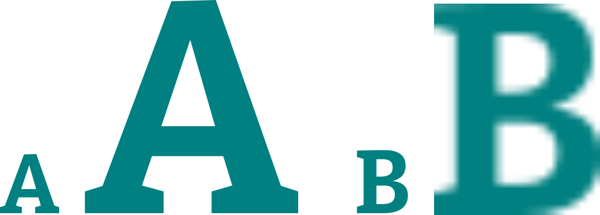
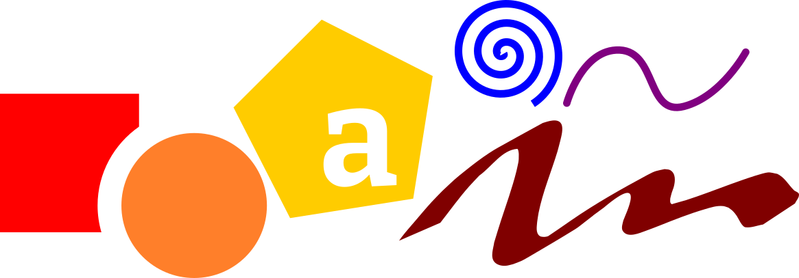
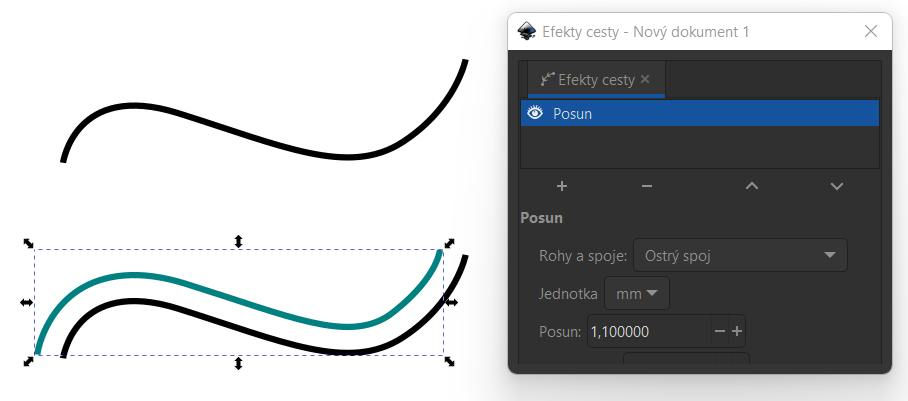
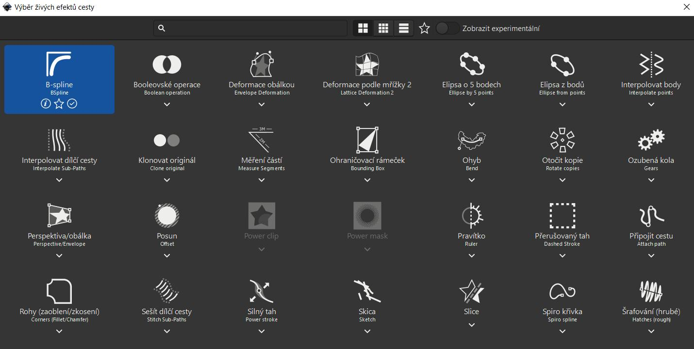

# Inkscape: Vektorové objekty
Inkscape nabízí řadu zajímavých nástrojů na vytváření a úpravu vektorových objektů. V programu lze také aplikovat bitmapové efekty a filtry.

## Rozdíl mezi bitmapovou a vektorovou grafikou

**Vektorová grafika**  (A) je definovaná parametry křivek. Proto je užitečná v případech, kdy se dá očekávat použití grafiky v různých velikostech a je důležitá bezztrátovost takových změn. Vektorové formáty se také používají v technických aplikacích pro CAD, CAM a CNC (.dxf, .stp).

Vektorová grafika je zpravidla úspornější co do velikosti souboru, záleží na složitosti křivek.

- Příklady vektorových formátů: .svg, .ai, .cdr

**Bitmapová grafika** (B) definuje mřížkou bodů, pixelů. Celkové rozlišení je pak konečná suma těchto bodů. FullHD rozlišení je 1920 krát 1080 pixelů (to je zhruba 2.1 miliónu pixelů, proto se někdy používá termín dvoumegapixel, 2MP). Rozlišení bitmapové grafiky se dá zvyšovat pomocí interpolace tak, že se chybějící body doplní algoritmicky (například pomocí umělé inteligence). Snížení rozlišení je ztrátové - zmenšený obrázek má celkově méně pixelů, méně informací.

- Příklady bitmapových formátů: .png, .jpg, .tiff

Některé bitmapové formáty mohou obsahovat vektorové objekty (.psd), a vektorové formáty pro polygrafii mohou většinou obsahovat bitmapové objekty.

:::note Formáty v Inkscapu

Hlavní formát ukládání je vektorový formát .svg. Hlavní formáty exportu jsou .png a .pdf.

:::

## Vektorové objekty, křivky a cesty

Hlavní zaměření programu Inkscape je tvorba a editace vektorových objektů. Aplikace bitmapových efektů a filtrů je užitečná pro ilustrace a doplňující grafické prvky.
### Geometrické tvary
Geometrické tvary, jako kruh, obdélník, text apod. které mají další měnitelné parametry (například zaoblení rohů u obdélníků) se pro aplikování vektorových efektů a editaci jednotlivých bodů musí převést na křivky neboli **cesty** (*Paths*)

### Efekty cesty
Parametrický efekt na vybranou cestu použiješ volbou z menu **Cesta ‣ Efekty cesty...**(*Path ‣ Path Effects*), v panelu použiješ ikonu :heavy_plus_sign: k přidání efektu:

Efekty lze aplikovat na otevřené i uzavřené cesty — aktivní možnosti jsou vždy zvýrazněné.

:::note Úkol

 Vyzkoušej si efekty na otevřených a uzavřených cestách.

:::
