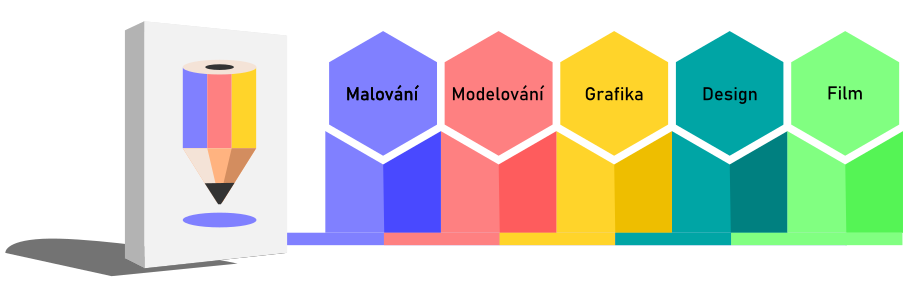
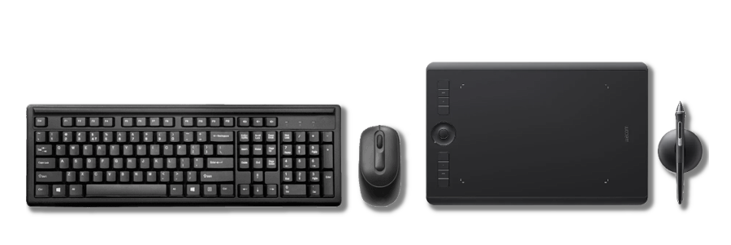

# Intro: Creativity and Open Source

## Course goals and methodology

The lessons on this site extend the content of the **Digital Academy** video series on YouTube. The software is selected to form a functional complete system for digital creation.

The lessons are designed with the aim of making their content and described procedures as transferable as possible to other programs. The courses aim to create a basis for further study and own experiments.   

## Who is this program for?

The courses are intended for artists, architects, designers and those interested in digital creation.

Lessons are focused on mastering the basic creative principles, valid independently of the medium. The concept is based on practical exercises in the software and is intended for both beginners and advanced students who want to discover new techniques.

:::tip

No one has ever become an expert **by watching videos on the internet**. You have to apply new knowledge, and learning is always a continuous process.

:::

## Language versions of software
The courses support Czech and English installation of programs. The reason is the practice that many professionals use the system and software in different language versions. Sometimes it is very difficult to find your way around terms you are not used to, and they also have several possible translations. In the case of important terms, the English original is also given in the text. Where the terminology is not established, I also list alternative terms that are used in the field or are more concise.

import Tabs from '@theme/Tabs';
import TabItem from '@theme/TabItem';

<Tabs
  groupId="jazykova-verze"
  defaultValue="czv"
  values={[
    {label: 'CZ verze', value: 'czv'},
    {label: 'EN verze', value: 'env'},
  ]
}>
<TabItem value="czv">Program máš v české verzi</TabItem>
<TabItem value="env">Program máš v anglické verzi</TabItem>
</Tabs>

## Do the courses require powerful equipment?

The courses assume at least average computer equipment for graphics applications. Some software uses a two-button mouse with a scroll wheel, and a numeric keypad is an advantage. Drawing and painting courses require a graphics tablet with pressure (although in theory it is possible to paint with a mouse ...).

:::note Note

Computer technology is just a tool. If you can use what you have effectively, you will not need what you do not have.

:::

## Why open-source?

To make the courses as accessible as possible, all lessons use professional, licensed software that is free to download. All programs also exist in versions for the most common operating systems.

:::
## Get started today!
The lessons are designed to be as effective as possible. The text focuses on elements and procedures that are **essential** for the functional knowledge of the programs. The goal is to use new techniques as quickly as possible.

## Themes

[Digital Drawing and Painting](01digitalnimalba/kresba-a-malba) (Krita)  
[3D Modeling and Sculpting](02modelovani/3D-modelovani) (Blender)  
[Graphic Design and Typography](03grafika/grafika) (Inkscape, Scribus)  
[Digital Photography](04foto/foto) (Gimp, Darktable)  
[Film Editing](05film/film) (Kdenlive, Blender)  
[Animation and Motion Design](06animace/animace) (Blender, Natron)  
[CAD and 3D Design](07cad/cad) (FreeCAD)

:::tip

Don't be distracted by ** anything ** while learning. The courses provide a fundamentals for further discovery in the given field. Each video lesson will fit in fifteen minutes. To study the text part, reserve the segments after fifteen minutes with a break. After each new topic, try the exercises.

:::
