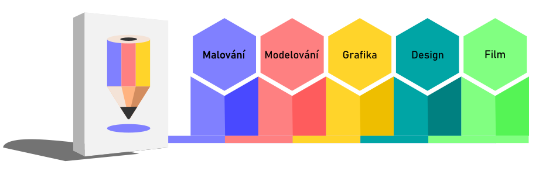
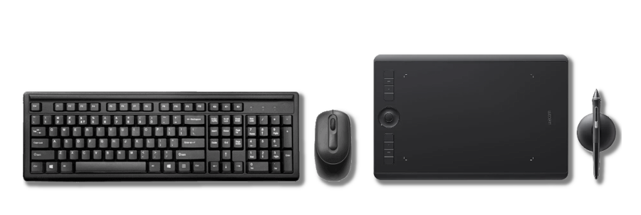

# Creatividad y Open Source

## Metas y metodología del curso

Las lecciones de este sitio amplían el contenido de la serie de videos de la **Academia Digital** en YouTube. El software se selecciona para formar un sistema completo funcional para la creación digital.

Las lecciones están diseñadas con el objetivo de hacer que su contenido y procedimientos descritos sean lo más transferibles posible a otros programas. Los cursos tienen como objetivo crear una base para futuros estudios y experimentos propios.

## ¿Para quién es este programa?

Los cursos están dirigidos a artistas, arquitectos, diseñadores e interesados en la creación digital.

Las lecciones se centran en el dominio de los principios creativos básicos, válidos independientemente del medio. El concepto se basa en ejercicios prácticos en el software y está destinado tanto a estudiantes principiantes como avanzados que quieran descubrir nuevas técnicas.

:::tip

Nadie se ha convertido en un experto **viendo videos en Internet**. Tienes que aplicar nuevos conocimientos y el aprendizaje es siempre un proceso continuo.

:::

## Versiones lingüísticas del software
Los cursos apoyan la instalación de programas en español e inglés. La razón es la práctica de que muchos profesionales utilizan el sistema y el software en diferentes versiones de idiomas. A veces es muy difícil orientarse en términos a los que no está acostumbrado, y también tienen varias traducciones posibles. En el caso de términos importantes, el original en inglés también se incluye en el texto. Cuando no se establece la terminología, también enumero términos alternativos que se utilizan en el campo o que son más concisos.

import Tabs from '@theme/Tabs';
import TabItem from '@theme/TabItem';

<Tabs
  groupId="jazykova-verze"
  defaultValue="czv"
  values={[
    {label: 'CZ verze', value: 'czv'},
    {label: 'EN verze', value: 'env'},
  ]
}>
<TabItem value="czv">Program máš v české verzi</TabItem>
<TabItem value="env">Program máš v anglické verzi</TabItem>
</Tabs>

## ¿Los cursos requieren un equipo potente?

Los cursos asumen al menos un equipo informático promedio para aplicaciones gráficas. Algunos programas utilizan un mouse de dos botones con una rueda de desplazamiento, y un teclado numérico es una ventaja. Los cursos de dibujo y pintura requieren una tableta gráfica con presión (aunque en teoría es posible pintar con un ratón ...).

:::note Nota

La tecnología informática es solo una herramienta. Si puede usar lo que tiene de manera eficaz, no necesitará lo que no tiene.

:::

## ¿Por qué código abierto?

Para que los cursos sean lo más accesibles posible, todas las lecciones utilizan software profesional con licencia que se puede descargar de forma gratuita. Todos los programas también existen en versiones para los sistemas operativos más comunes.

:::
## ¡Empiece a aprender hoy!
Las lecciones están diseñadas para ser lo más efectivas posible. El texto se centra en elementos y procedimientos **esenciales** para el conocimiento funcional de los programas. El objetivo es utilizar nuevas técnicas lo más rápido posible.

## Themes

[Digital Drawing and Painting](01digitalnimalba/kresba-a-malba) (Krita)  
[3D Modeling and Sculpting](02modelovani/3D-modelovani) (Blender)  
[Graphic Design and Typography](03grafika/grafika) (Inkscape, Scribus)  
[Digital Photography](04foto/foto) (Gimp, Darktable)  
[Film Editing](05film/film) (Kdenlive, Blender)  
[Animation and Motion Design](06animace/animace) (Blender, Natron)  
[CAD and 3D Design](07cad/cad) (FreeCAD)

:::tip

No te distraigas con **nada** mientras aprendes. Los cursos proporcionan los fundamentos para un mayor descubrimiento en el campo dado. Cada videolección ocupará quince minutos. Para estudiar la parte de texto, reserve los segmentos después de quince minutos con un descanso. Después de cada tema nuevo, pruebe los ejercicios.

:::
